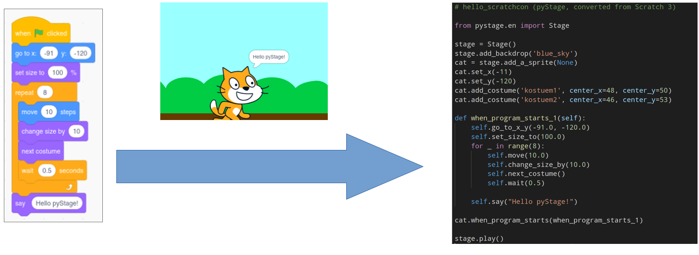

# PyStage

[](https://pystage.readthedocs.io/en/latest/?badge=latest)

Scratch-like Python programming.

PyStage bridges the gap between [Scratch](https://scratch.mit.edu/) and Python. This module implements all code blocks
as available in scratch. With the PyStage command line converter Scratch projects can be easily
transferred to Python executable Code. To run your game in Python, PyStage uses [PyGame](https://www.pygame.org/news).



## Demo

Consider the following code. It defines a stage and a sprite on the stage. The functions are code blocks that are associated with events (i.e. connected to a hat block in Scratch) via the corresponding methods.

```python
from pystage.en import Stage

stage = Stage()
stage.add_backdrop("grid")
zombie = stage.add_a_sprite()

def doit(zombie):
    zombie.say("Hello pyStage!")
    for i in range(4):
        zombie.move(10)
        zombie.wait(1)
        zombie.think("This is awesome!")
        zombie.turn_left(90)
        zombie.wait(1)
        zombie.think("")
    zombie.say("Move me around with WASD.")

zombie.when_program_starts(doit)

def right(zombie):
    zombie.change_x_by(10)

def left(zombie):
    zombie.change_x_by(-10)

def up(zombie):
    zombie.change_y_by(10)

def down(zombie):
    zombie.change_y_by(-10)

zombie.when_key_pressed("d", right)
zombie.when_key_pressed("a", left)
zombie.when_key_pressed("w", up)
zombie.when_key_pressed("s", down)

stage.play()

```

And here is the result:


## Goals
* Export your Scratch project to real executable Python code!
* Helping coding beginners to learn Python "by Scratch".
* Implementation of scratch blocks in several languages (ideal for kids). As of now en and de.


[](https://www.youtube.com/watch?v=Bo3kUF9k0Vg)

[See our quick intro to PyStage for ScratchCon 2021](https://www.youtube.com/watch?v=Bo3kUF9k0Vg)


# Installation
```pip install pystage```

# Getting started

If you are interested in PyStage and want to get in touch, feel free to join us on our [Discord Server](https://discord.gg/MSGrs3UCCz).

Currently, only the English API is fully translated, the German API is automatically generated. All other languages will be added when PyStage gets more stable. Get in touch if you want to help maintain a translation.

For the English API, you can start with the following example code:

```python
from pystage.en import Sprite, Stage

stage = Stage()
zombie = stage.add_a_sprite()

def doit(zombie: Sprite):
    for i in range(4):
        zombie.move(10)
        zombie.turn_left(90)
        zombie.wait(1)

zombie.when_program_starts(doit)

stage.play()
```

Use the autocompletion of your editor to see what methods are available. There are methods for all Scratch blocks bound to your stage and sprite instances. Not all of them work. Motion and Looks is mostly implemented (besides graphics effects), the Pen extension works and most of Sensing should work as well. If you want to know the details, just check the files under `src/pystge/core`. 

The documentation is here: https://pystage.readthedocs.io/en/latest/pystage.en.html

---

**NOTE**

Please note this is a pre alpha version. Not all things may work as expected. If so, please contact us or open an issue. Documentation is automatically generated but especially the user-facing block API is still mostly empty.

---

# Import your Scratch projects
Converting a Scratch project to Python code:
1. Export your Scratch project on the Scratch page. You will get an .sb3 file.
2. Use our command line converter. Yes, it's unhandy, we will work on it to make things easier.

The base usage is ```python -m pystage.convert.sb3 <SB3 File> -l en -d <DIRECTORY>```
The parameters are:
* ```-l``` language of generated python "scratch blocks". In the moment of writing, ```en``` and ```de``` are available.
* ```-d``` the output directory, defaults to current directory
* ```-i``` print intermediate code representation
* ```-s``` print sb3 project.json
* ```-p``` print python code
* ```-v``` verbose
* ```-vv``` debug mode


# Contributors

* Kai Eckert, Stuttgart Media University
* Florian Rupp, Stuttgart Media University
