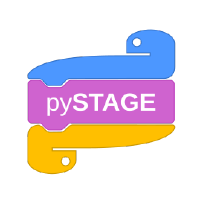

.. PyStage Documentation documentation master file, created by
   sphinx-quickstart on Thu May 27 11:41:12 2021.
   You can adapt this file completely to your liking, but it should at least
   contain the root `toctree` directive.

Welcome to PyStage's documentation!
=================================================

.. mdinclude:: ../../README.md

.. make hidden section for nav bar left
.. toctree::
    :caption: PyStage API Translations
    :maxdepth: 2
    :hidden:

    languages

.. include:: languages.rst

.. this is a comment
.. Indices and tables
.. ==================

.. * :ref:`genindex`
.. * :ref:`modindex`
